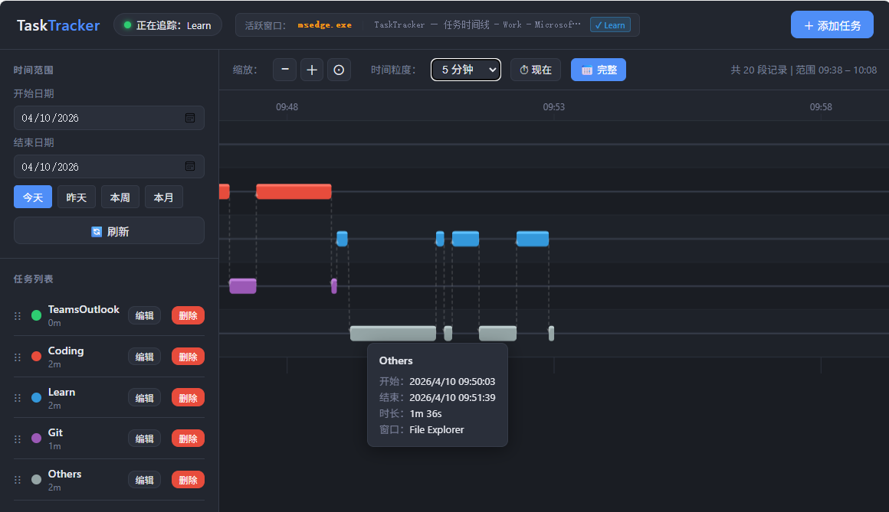

# TaskTracker

A Windows application that monitors active window usage and categorizes time into user-defined tasks. Raw window data is stored in SQLite and tasks are derived dynamically at query time via configurable keyword matching — so you can redefine tasks without losing history.

## Features

- **Real-time tracking**: Polls the active window every N seconds and records process name, window title, and timestamps
- **Flexible task mapping**: Task labels are applied at query time, not storage time — change definitions freely without affecting historical data
- **Interactive Gantt chart**: Canvas-based timeline with zoom, pan, hover tooltips, and Bezier transition curves
- **Task management**: Create, edit, delete, and reorder tasks from the web UI
- **Manual segments**: Add or delete time segments manually
- **Date range filtering**: Quick buttons for today / yesterday / this week / this month
- **Auto-refresh**: Dashboard updates every 10 seconds

## Demo



## Tech Stack

| Layer | Technology |
|-------|-----------|
| Backend | Python 3, Flask |
| Database | SQLite3 (built-in) |
| Window detection | pywin32 |
| Frontend | Vanilla JS, HTML5 Canvas |

## Installation

```bash
pip install -r requirements.txt
```

## Usage

```bash
start.bat
```

Then open `http://localhost:5000` in your browser.

Alternatively, run directly:

```bash
python app.py
```

This starts both the background tracker thread and the Flask web server.

## Configuration

Edit `config.json` to define tasks and tracking settings:

```json
{
  "tasks": [
    {
      "id": "coding",
      "name": "Coding",
      "color": "#e74c3c",
      "keywords": ["Code.exe", "vscode", "PyCharm"]
    },
    {
      "id": "others",
      "name": "Others",
      "color": "#95a5a6",
      "keywords": []
    }
  ],
  "settings": {
    "poll_interval_seconds": 3,
    "idle_threshold_seconds": 120,
    "min_segment_seconds": 5
  }
}
```

- **keywords**: Case-insensitive substrings matched against process name or window title. A task with an empty keyword list acts as a catch-all fallback.
- **min_segment_seconds**: Segments shorter than this are ignored.
- **idle_threshold_seconds**: Inactivity duration before the current segment is closed.

Configuration can be updated live via the API without restarting.

## Database Schema

```sql
CREATE TABLE process_segments (
    id            INTEGER PRIMARY KEY AUTOINCREMENT,
    process_name  TEXT NOT NULL,
    start_time    REAL NOT NULL,   -- Unix timestamp
    end_time      REAL,            -- NULL if segment is still open
    window_title  TEXT
)
```

## API Reference

| Method | Endpoint | Description |
|--------|----------|-------------|
| GET | `/api/status` | Current tracking status and active window |
| GET | `/api/segments` | List segments (supports `from`/`to` Unix timestamp params) |
| GET | `/api/tasks` | List all configured tasks |
| POST | `/api/tasks` | Create or update a task |
| DELETE | `/api/tasks/<id>` | Delete a task |
| POST | `/api/tasks/reorder` | Reorder tasks |

## Files

| File | Description |
|------|-------------|
| `app.py` | Flask web server and REST API |
| `tracker.py` | Background window monitoring daemon |
| `config.json` | Task definitions and tracking settings |
| `static/index.html` | Single-page web dashboard |
| `tasktracker.db` | SQLite database (auto-created on first run) |
| `tracker.log` | Tracker daemon log |
| `start.bat` | Launches tracker and web server |

## Troubleshooting

- **Tracker not recording**: Check `tracker.log` for errors; ensure pywin32 is installed correctly.
- **Tasks not matching**: Use the status indicator on the dashboard to see the exact process name and window title being captured, then update keywords accordingly.
- **Database errors**: Delete `tasktracker.db` and restart to recreate it (all history will be lost).

## License
MIT